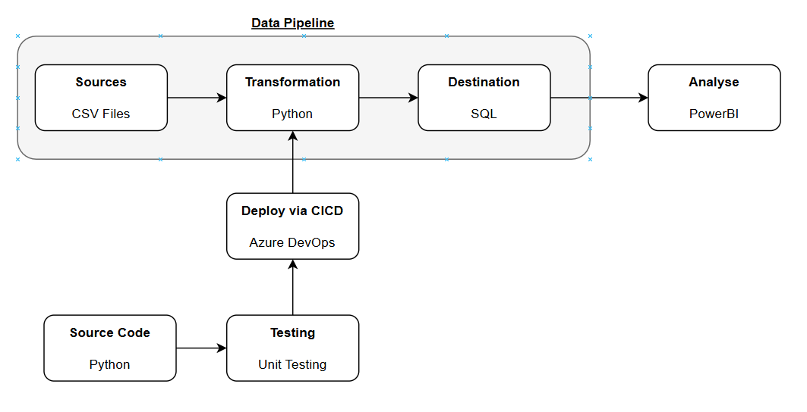

# DE5-M5
## Architectural Diagram
The proposed solution for MVP:

# Code Structure

A typical python programme will do the following:

1. Import libraries (aka dependencies)
2. Define useful functions (generalised code)
3. Use the functions to transform objects 
4. Create an output or do some functionality